# Widget Workshop
I denne workshopen skal du lære å opprette widgets i et iOS swift prosjekt.


<details>
<summary>0. Opprett prosjekt</summary>

## Prosjekt
Lag et nytt prosjekt i Xcode eller finn frem et prosjekt hvor du ønsker å legge til widgetfunksjonalitet. </details>
<details>

<summary>1. Legge til en widget</summary>

## 1.0 - Legge til en widget
For å legge til en widget må du:
1. Velg prosjektet i Xcode i explorer. 
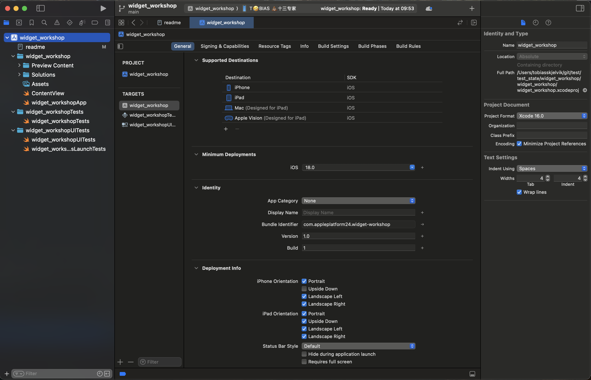
2. Deretter trykker du på plus-tegnet nederst i "General". 
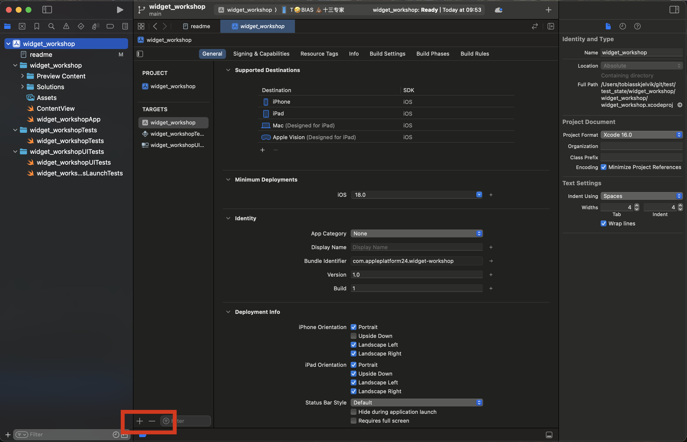
3. Søk etter widget i vinduet som dukker opp. 
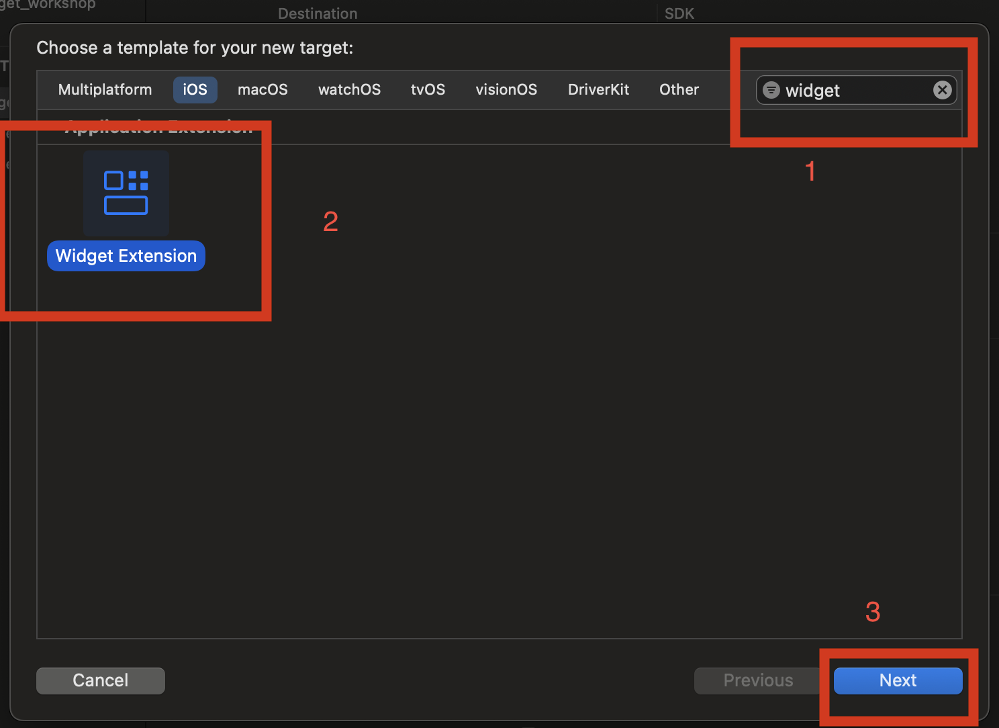
4. Velg et navn på widgeten
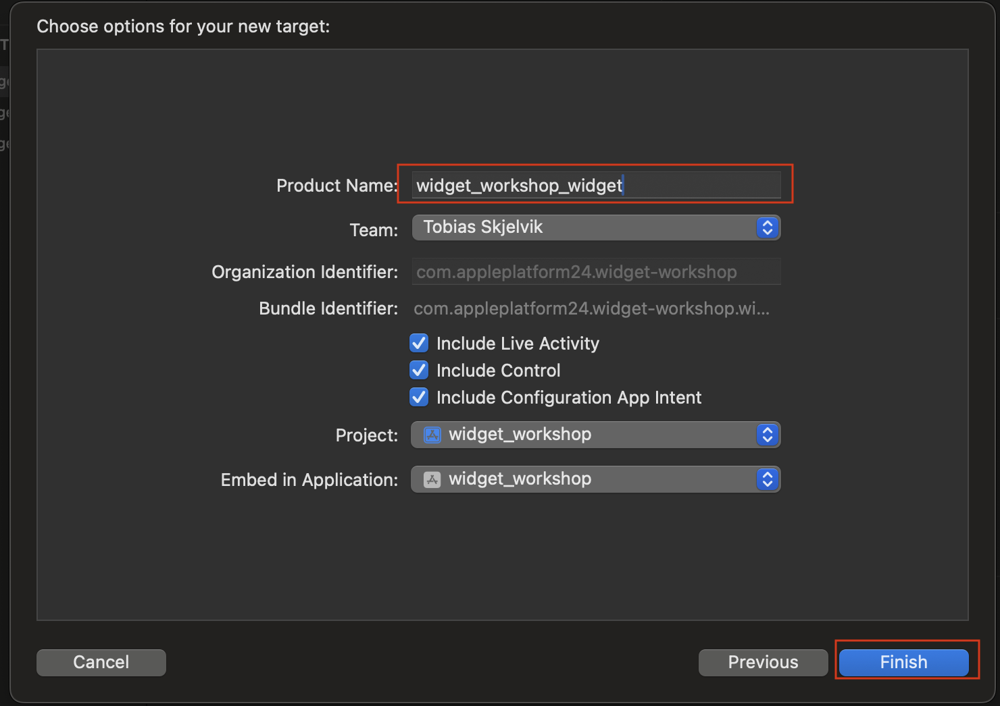
5. Du får spørsmål om scheme, her er det ikke så farlig hva du velger. Men trykk gjerne activate. Se punkt under om scheme.
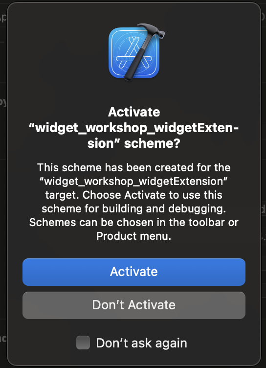
6. Naviger til den nye mappen som ble lagt til, med navnet du valgte i tidligere steg.
7. Åpne filen med samme navn som mappen. Du bør kunne se en widget dukke opp i preview.

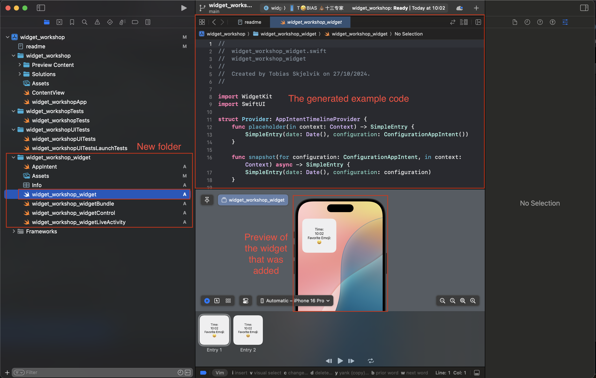


### Gratulerer du har lagt til en widget til iOS prosjektet.
Nå må vi forstå hva de er vi har lagt til.

</details>


<details>
<summary>Hva er scheme?</summary>

### Scheme
Tidligere fikk du spørsmål fra XCode om du ønsket å aktivere scheme for widgeten. Det scheme gjør er (grovt forenklet) å si hvilket produkt i prosjektet ditt du ønsker å bygge og kjøre på en simulator eller telefon.

Du kan enkelt endre dette når som helst ved å trykke på produktet/valgt scheme øverst i XCode. 

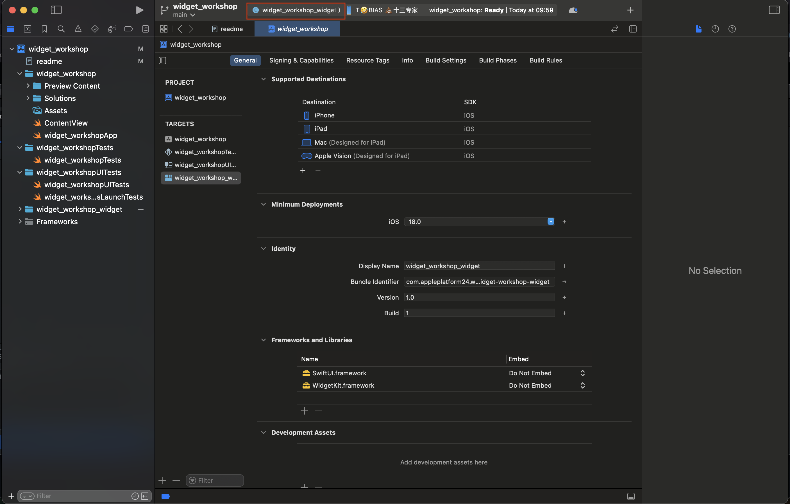
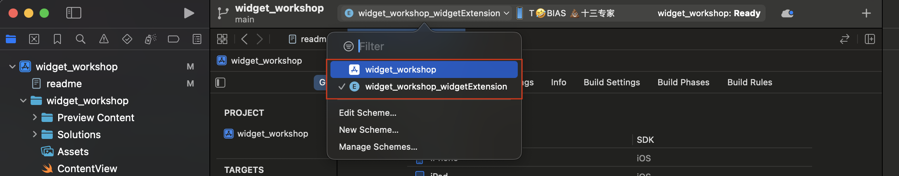
Hvis man jobber med ulike produkter som Widget, iOS App, WatchOS app, så bytter man ofte mellom disse.
</details>

<details>
<summary>2. Hva har vi lagt til?</summary>


## 2.0 
*Her forklares hva vi har lagt til av kode fra Apple. Hvis du ikke er interessert kan du hoppe rett til punkt 3.*

I den nye mappen som ble generert ligger det fire filer. Nå inneholder de eksempelkode fra Apple for deres "Emoji Ranger Widget". 

Alle filene begynner med navnet du valgte på widgtenen. Filene er altså:

1. `<widget_navn>_widget`
2. `<widget_navn>_widgetBundle`
3. `<widget_navn>_widgetControl`
4. `<widget_navn>_widgetLiveAcivity`
5. AppIntent

<details>
<summary>widget_navn_widget</summary>

### widget_navn
Denne filen er selve widgeten, og det er her vi kommer til å jobbe mest i dag. Dette er filen som lager widget som lever på hjemskjermen og låseskjermen på iPhone. Nå inneholder filen et autogenerert widget-eksempel med noen emojis.

</details>

<details>
<summary>widget_navn_widgetLiveActivity</summary>


### widget_navn_widgetLiveActivity
Denne filen er en såkalt "Live Activity" widget. Hvis du har kjøpt en kollektivtrafikkbillett, eller bestilt mat fra wolt/foodora kan det hende du har sett en timer på låseskjermen på iPhone som sier hvor lenge det er igjen av billetten din, eller hvor lenge det er til maten ankommer. Disse er "Live Activites". Hvis du ønsker en slik i din app, så er denne filen et autogenerert eksempel fra Apple.

https://developer.apple.com/documentation/activitykit/displaying-live-data-with-live-activities

</details>

<details>
<summary>widget_navn_widgetControl</summary>

### widget_navn_widgetControl
Dette er en "Control Widget". For å la brukere konfigurere widgets (endre farge, endre hvilke felt som vises i widgeten), så kan man legge til en Control Widget. 

En bruker vil da kunne "long-presse" på en widget, for å få opp Control Widgeten. 

Du kan tenke på det som et ekstra view på widgeten hvor man kan endre på settings.

Filen har autogenerert eksempelkode for Apple sin Emoji Ranger widget.

https://developer.apple.com/documentation/swiftui/controlwidget

Se hvordan det fungerer med emoji-ranger eksempelet fra apple:
1. Long press på widgeten på hjemskjermen
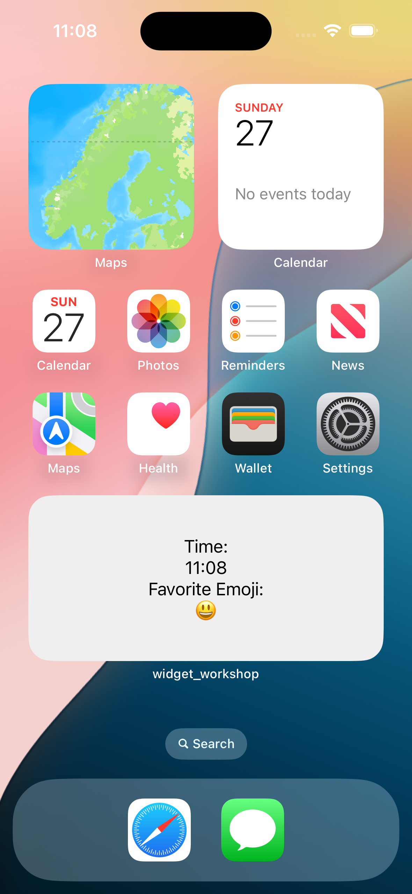

2. Etter å ha longpressed vil du se en meny, velg "Edit Widget"
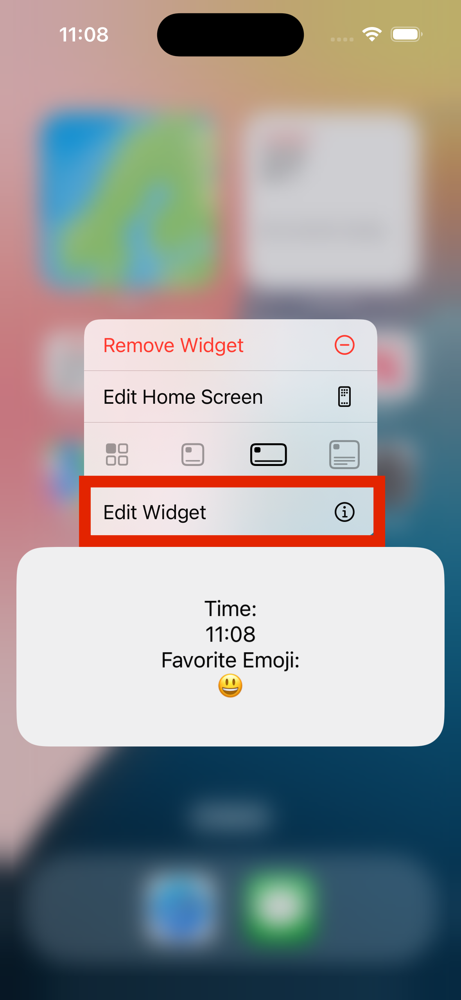

3. Du skal nå se Widget Control-koden din på devicen / simulatoren du kjører på. Kjenner du igjen koden?
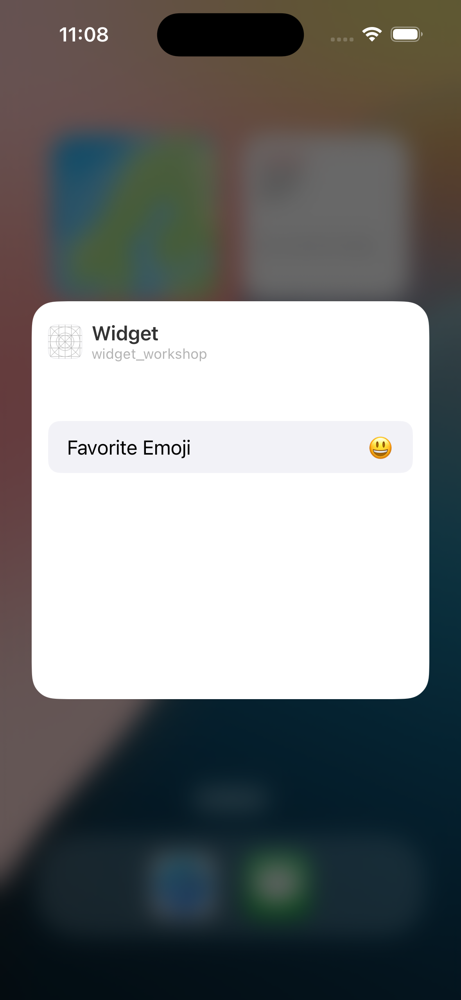

4. Prøv å endre teksten på favourite emoji.
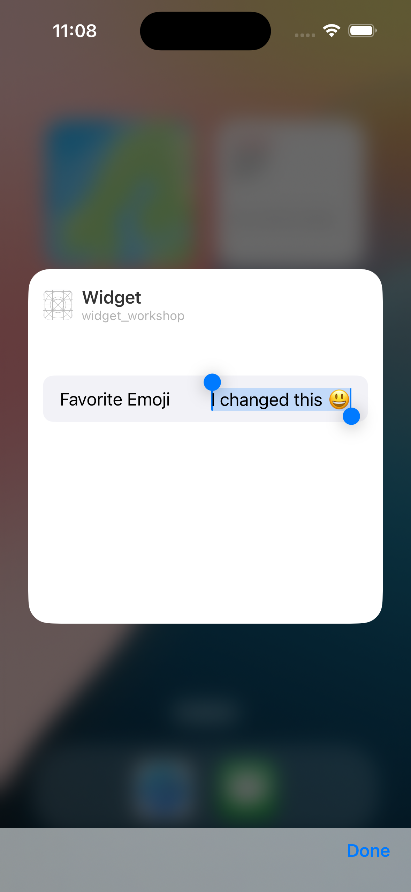

5. Trykk utenfor Widget Control for å lukke den, og se resultatet av endringene på hjemskjermen i widgeten. 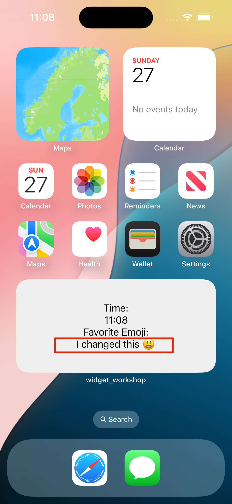

</details>

<details>
<summary>widget_navn_widgetBundle</summary>

### widget_navn_widgetBundle
Dette er en fil som eksponerer widgetsene dine ut til iOS. Hvis du har laget flere widgets, som en home screen widget, og en live activity, så kan de wrappes i en widgetBundle slik at de alle blir tilgjengelige på iPhone hvis appen din er installert.

https://developer.apple.com/documentation/swiftui/widgetbundle

</details>

<details>
<summary>AppIntent (WidgetConfigurationIntent)</summary>

### WidgetConfigurationIntent 
Denne filen definerer data som man kan sende inn til widgeten. I Den genererte "widget_navn_widget" fila vil man kunne se "SimpleEntry" struct-en. Denne tar inn configuration, som inneholder data som blir vist frem i widgeten. Emoji-eksempelet definerer to statiske "intents" 

```
extension ConfigurationAppIntent {
    fileprivate static var smiley: ConfigurationAppIntent {
        let intent = ConfigurationAppIntent()
        intent.favoriteEmoji = "😀"
        return intent
    }
    
    fileprivate static var starEyes: ConfigurationAppIntent {
        let intent = ConfigurationAppIntent()
        intent.favoriteEmoji = "🤩"
        return intent
    }
}
```

Og det er disse som blir brukt i preview-vinduet. 

```
#Preview(as: .systemSmall) {
    widget_workshop_widget()
} timeline: {
    SimpleEntry(date: .now, configuration: .smiley)
    SimpleEntry(date: .now, configuration: .starEyes)
}

```

Som igjen blir brukt i TimeLineEntry-en

```
struct SimpleEntry: TimelineEntry {
    let date: Date
    let configuration: ConfigurationAppIntent
}

struct widget_workshop_widgetEntryView : View {
    var entry: Provider.Entry

    var body: some View {
        VStack {
            Text("Time:")
            Text(entry.date, style: .time)

            Text("Favorite Emoji:")
            Text(entry.configuration.favoriteEmoji)
        }
    }
}
```

Hvordan denne timeline-entryen og alt henger sammen kommer vi tilbake til senere.

https://developer.apple.com/documentation/appintents/widgetconfigurationintent

</details>


</details>

---

<details>
<summary>Prøv å kjør widget (fiks error)</summary>

### Kjør widgeten på simulator eller device
Kjør eksempel-widgeten på simulator ved å trykke play i XCode. Får du sett emoji-ranger widgeten? Prøv å long-presse for å få opp widget control.

### Feilsøking
Det kan hende du får feilen som på bildet her:
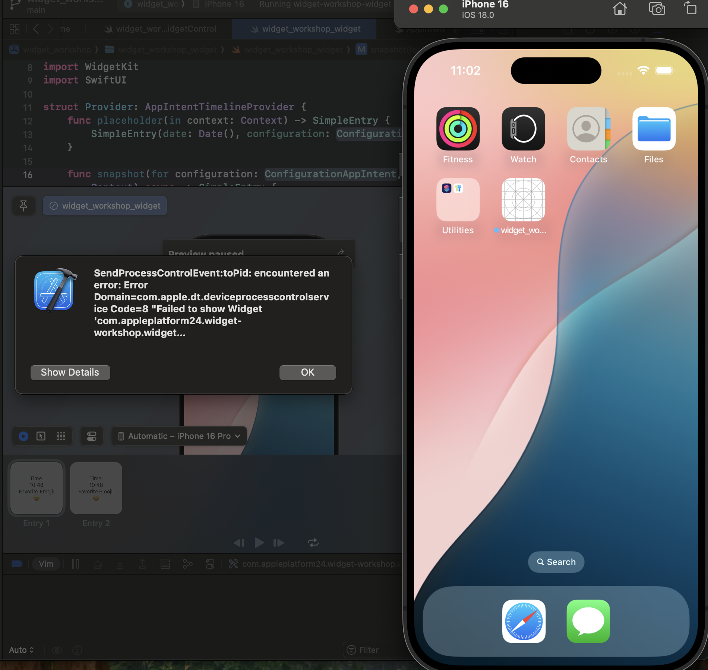

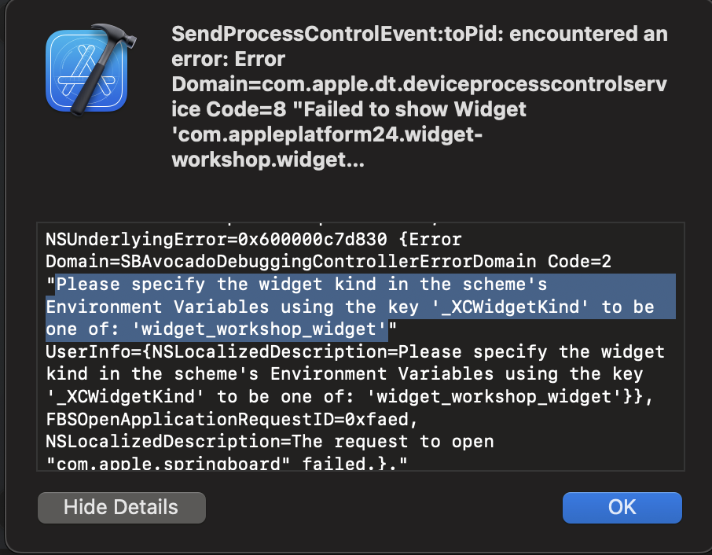

For å fikse dette må vi inn i scheme-et for widgeten og sette hvilken widget vi ønsker at xcode skal kjøre i gang på simulatoren / devicen din.

Følg bildene:


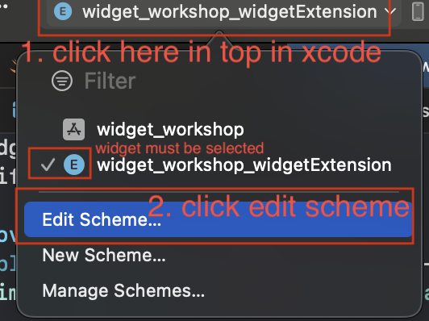

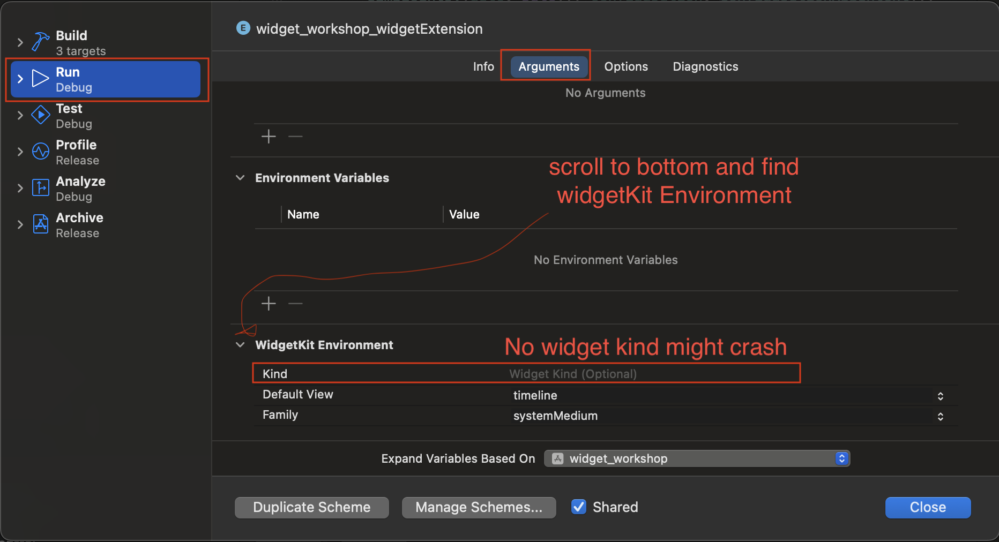

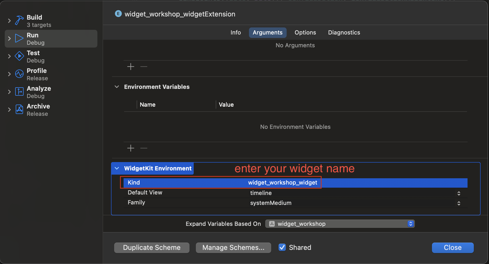

**OBS! Vær nøye med at du skriver inn nøyaktig samme string som widget-filen din heter**

Prøv å kjør på nytt. Nå skal det fungere.


</details>

---

<details>
<summary>3 Hvordan fungerer widgeten?</summary>

### 3. Hvordan fungerer widgeten?
Før vi setter i gang med å endre widgeten må vi vite hvordan en widget kjører og fungerer.


En widget er et view, som tar inn data – veldig likt resten av SwiftUI views.
Forskjellen er at iOS på iphone/ipad ønsker å planlegge rendering av widgeten så godt som mulig, for å spare ressurser. Derfor er det litt forskjellig som foregår bak kulissene.

Når du har en widget på hjemskjermen din slik som på bildet her (fortsetter under bildet):

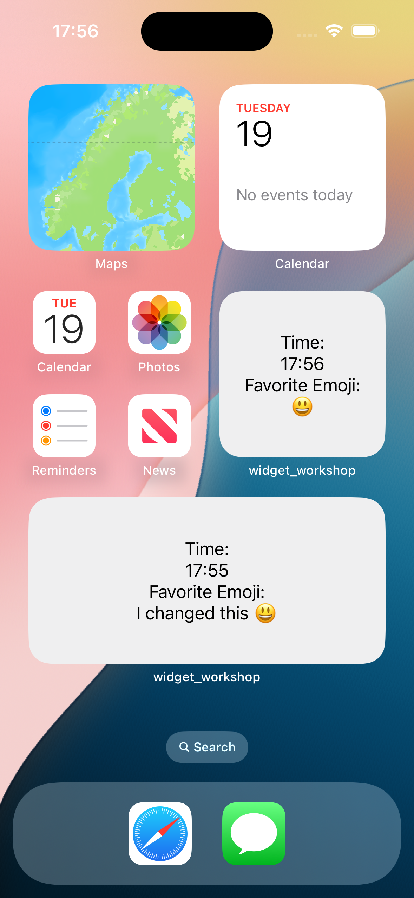</img>
 
 Så er det et enkelt view som tar inn informasjon og viser det frem på skjermen. Tenk på det som 

 ```
View + dataobjekt som populerer viewet (Time, favourite emoji)
 ```

Men hva med denne optimaliseringen og planleggingen?
Jo... det er her en ```Timeline```kommer inn i bildet. Widgetkit lager nemlig en tidslinje med flere ```dataobjekt``` som den planlegger å skyte inn i viewet ved gitte intervaller fremover i tid.  

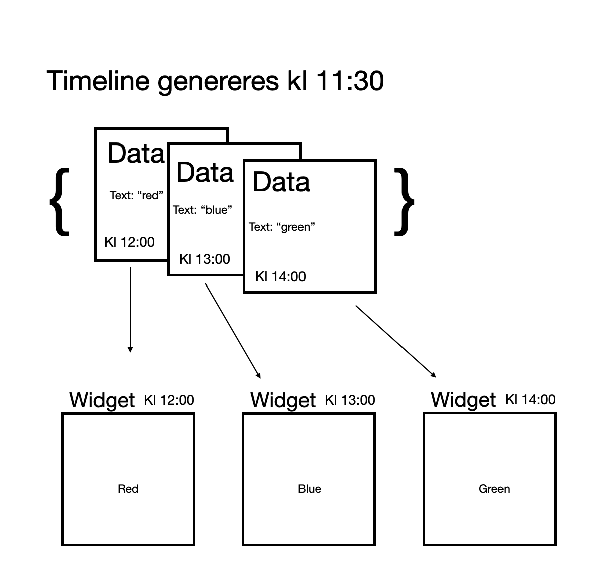</img>

Her på bildet genereres 3 entries som populerer widgeten kl. 12, kl. 13 og kl. 14.

Etter widgeten kl 14. er laget, vil en ny timeline med entries genereres og widgeten viser frem den nye timelinen. Repeat.

<br>

## Hvordan ser dette ut i koden?
Vi skal nå altså se hvordan vi lager en "timeline" med "entries" (dataobjekter) i koden. Vi begynner med "entries".

Åpne fila "widget_navn_widget".
For meg er dette <mark>widget_workshop_widget</mark>. 

I toppen finner du en `struct Provider: ...` med noen funksjoner i. <mark>Hopp over denne for nå. Scroll forbi ned til SimpleEntry </mark>

```
struct SimpleEntry: TimelineEntry {
    let date: Date
    let configuration: ConfigurationAppIntent
}
```

Dette er en "entry" som inngår i timelinen vår. Den har en date, og en configuration av typen `ConfigurationAppIntent`. Hvis vi navigerer til filen `AppIntent` vil vi se at dette igjen et slags data-objekt.

```
import WidgetKit
import AppIntents

struct ConfigurationAppIntent: WidgetConfigurationIntent {
    static var title: LocalizedStringResource { "Configuration" }
    static var description: IntentDescription { "This is an example widget." }

    // An example configurable parameter.
    @Parameter(title: "Favorite Emoji", default: "😃")
    var favoriteEmoji: String
}

```

Til sammen utgjør `SimpleEntry` med sin `ConfigurationAppIntent` en struct som har, en `Date`, en `title`, en `description` og en `favoriteEmoji`. (Den siste kan konfigureres fra widget-control, det kan du lese om senere).


La oss nå se hvor denne structen `SimpleEntry` blir brukt. Rett under `SimpleEntry` finner vi en `widgetEntryView`. 

```
struct widget_workshop_widgetEntryView : View {
    var entry: Provider.Entry

    var body: some View {
        VStack {
            Text("Time:")
            Text(entry.date, style: .time)

            Text("Favorite Emoji:")
            Text(entry.configuration.favoriteEmoji)
        }
    }
}
```


Dette er viewet til widgeten vår. Hvis vi ser på bildet av widgeten igjen så kan du forhåpentligvis se hvordan kodan mapper om til widgeten i iOS. På den nederste litt bredere widgeten har jeg endret parameteren som nevnt i configuration.

</img>


OK. Nå har vi gått gjennom datastrukturen (entry) og viwet vårt. Hva med timelinen med entries?


Naviger tilbake øverst i fila ```widget_navn_widget```. Her vil du finne en struct Provider, som implemeneterer en AppIntentTimeLineProvider.

```
struct Provider: AppIntentTimelineProvider {
    // ...
}
```

Det er denne som har ansvar for å generere alle `SimpleEntry` som widgeten skal inneholde. Sammen utgjør flere av `SimpleEntry`en `timeline`.

Provideren har tre funksjoner, _placeholder_, _snapshot_, og _timeline_:

```
 func placeholder(in context: Context) -> SimpleEntry {
        // ...
    }

func snapshot(for configuration: ConfigurationAppIntent, in context: Context) async -> SimpleEntry {
        // ...
    }

func timeline(for configuration: ConfigurationAppIntent, in context: Context) async -> Timeline<SimpleEntry> {
    // ...
    }
```

```func timeline(...)``` er funksjonen som er ansvarlig for å genere timelinen. Jeg liker å se på det som at den spytter ut en liste med dataobjekter, og tidspunktet hver av dem skal vises frem. Vi ser at den er `async` og returnerer `-> Timeline<SimpleEntry>`.

Det er i timeline du kommer til å jobbe mest når du jobber med widgets. La oss kjapt gå gjennom placeholder or snapshot også før vi begynner å pusle med koden.


```func placeholder``` er en funksjon som lager et eksempel på hvordan widgeten din skal se ut. Dette eksempelet er når du velger widgets å legge til på hjemskjermen på iOS. 

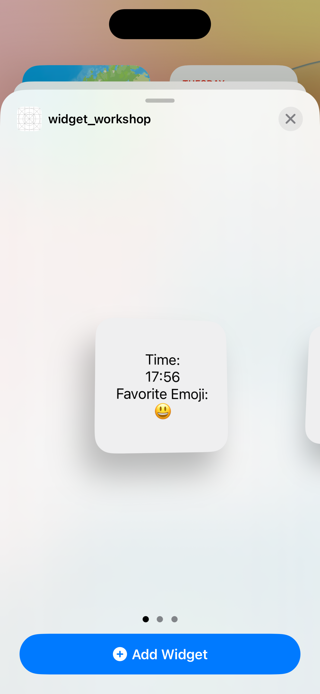</img>

På bildet over ser du eksempel-widgeten bli vist frem. funksjonen `placeholder` returnerer én `SimpleEntry` istedenfor en `Timeline<SimpleEntry>`. Det er fordi vi kun trenger å genere étt view når eksempelet vises frem. 

Funksjonen er heller ikke async, så når du skal lage en eksempel-widget gjelder å ha dummy data klar til å genere widgeten, imotsetning til timelinen som kan gjøre async-kall for å hente nødvendig data.

```func snapshot``` gjør nesten det samme som placeholder. Den  retunerer også bare én ```SimpleEntry``` men denne brukes bare når widgeten din er i endring. Hvis widgeten f.eks har nådd slutten av sin `timeline` med `entries` og trenger å laste ny data -> vil den typisk gjøre et `async` kall for å hente data. Da har ikke Widgeten noen data å vise frem lenger. Det den istedenfor defaulter til da er `snapshot` sin `SimpleEntry`. Typisk vil dette være et `skeletonView` av widgeten din, som bare er synlig en kort stund, og signaliserer til brukeren at her kommer det til å dukke opp noe data snart. Dette kan også vises rett etter du har lagt en widget til hjemskjermen hvis det tar lit tid å genrere `timelinen`.


## Det siste i widget-fila
Nederst i fila finner du selve widgeten, samt oppsett for preview.

```
struct widget_workshop_widget: Widget {
    let kind: String = "widget_workshop_widget"

    var body: some WidgetConfiguration {
        AppIntentConfiguration(kind: kind, intent: ConfigurationAppIntent.self, provider: Provider()) { entry in
            widget_workshop_widgetEntryView(entry: entry)
                .containerBackground(.fill.tertiary, for: .widget)
        }
    }
}
```

I koden over defineres en struct som implementerer `Widget`. Det er denne som blir pakket inn i `WidgetBundle`i en annen fil og til slutt ender opp på iPhonen.

I koden må man ha en `kind`, denne stringen identifiserer en eller flere widgets. Det kan brukes når du ønsker å tvinge gjennom en refresh av en eller flere widgets fra appen din. (Jeg gjør dette hver gang noen brukere åpner UV-stråling appen min, og jeg henter nye værdata).

Ellers tar den inn `AppIntentConfiguration` som vi kikket på tidligere, og provideren. Her henter den entries ut av provideren og setter dem inn i `widget` med en viewModifier for bakgrunnsfarge.


Det siste du finner i widget-fila er en extension som oppretter to statiske `ConfigurationAppIntent` som vi så på litt tidligere. 


```
extension ConfigurationAppIntent {
    fileprivate static var smiley: ConfigurationAppIntent {
        let intent = ConfigurationAppIntent()
        intent.favoriteEmoji = "😀"
        return intent
    }
    
    fileprivate static var starEyes: ConfigurationAppIntent {
        let intent = ConfigurationAppIntent()
        intent.favoriteEmoji = "🤩"
        return intent
    }
}
```

De to statiske `configuration`sendes inn i `#Preview` i hver sin `SimpleEntry`. I preview kan du da se at du kan klikke deg gjennom de to `entriene` i `timelinen`, som om du går fremover i tid på en device.

```
#Preview(as: .systemSmall) {
    widget_workshop_widget()
} timeline: {
    SimpleEntry(date: .now, configuration: .smiley)
    SimpleEntry(date: .now, configuration: .starEyes)
}

```

Her har kan du tilogmed trykke play og loop, og se widgeten simulere endring i tid. (Men dette krever ganske mye jobb med oppsett av configurations så jeg har aldri gjort dette selv).

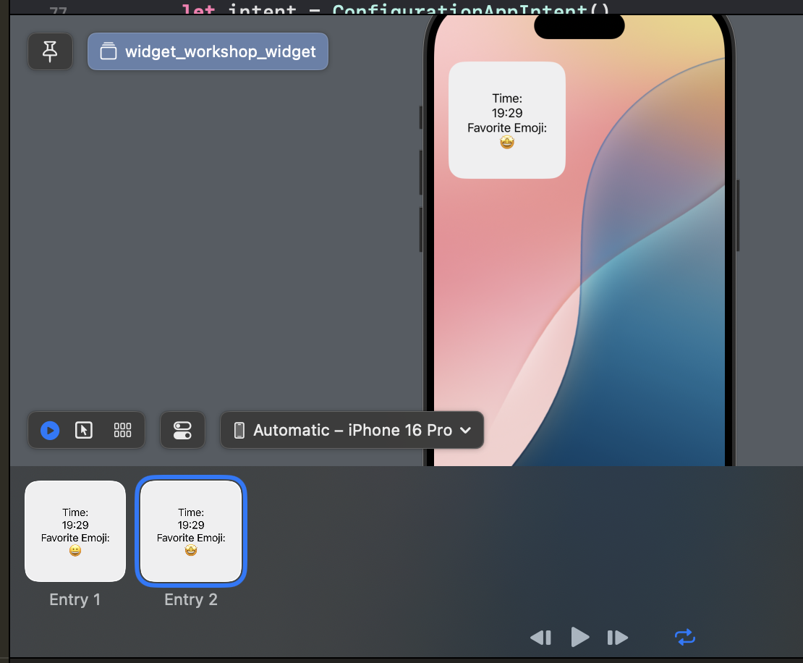</img>


</details>

<details>
<summary>4. Endre widget-koden</summary>


## Tid for å endre litt på koden.
Vi begynner med noe enkelt.

### 4a

Naviger til filen `<project_name>_widget`.
Naviger til 

```
struct SimpleEntry: TimelineEntry {
    let date: Date
    let configuration: ConfigurationAppIntent
}

struct widget_workshop_widgetEntryView : View {
    var entry: Provider.Entry

    var body: some View {
        VStack {
            Text("Time:")
            Text(entry.date, style: .time)

            Text("Favorite Emoji:")
            Text(entry.configuration.favoriteEmoji)
        }
    }
}

```

Prøv å endre noe i VStacken, som f.eks `Text("Time")` til `Text("Skibidi christmas")`.

Etterpå kan du prøve å se at widgeten har endret seg i både widget preview (der du velger widgets) og på selve widgeten på hjem-skjermen. (Du finner løsning i solutions 4a)

### 4b 

Nå skal vi prøve å endre på dataen som sendes inn i snapshot (preview av widgeten) - og se at vi kan ha forskjellige ting som rendres på hjem-skjermen og på snapshot.

Klarer du å få placeholderen til å si "Chocolate", Preview til å si "Skibidi" og kjørende i simulator til å si "Water"?


<details>
<summary>Tips</summary>

Du må endre på `SimpleEntry`

</details>

<details>
<summary>SPOILER: Løsning</summary>

Du må endre på `SimpleEntry`. 
Legg til en ekstra variabel av typen `String`. Her: `var secretMessage: String = "Skibidi"`

```
struct SimpleEntry: TimelineEntry {
    var secretMessage: String = "Skibidi"
    let date: Dat`
    let configuration: ConfigurationAppIntent
}
```

Deretter må du oppdatere viewet til widgeten din:

Her må vi kalle på `entry` som holder variabelen i `SimpleEntry`.

```
struct widget_workshop_widgetEntryView : View {
    var entry: Provider.Entry

    var body: some View {
        VStack {
            Text("Skibidi Christmas")
            Text(entry.date, style: .time)
            
            Text(entry.secretMessage)
            
            Text("Favorite Emoji:")
            Text(entry.configuration.favoriteEmoji)
        }
    }
}
```

Nå skal du få en del feilmeldinger fra `snapshot`, `timeline`, `placeholder` og `#Preview`. Send inn den nye variabelen din og se de flotte beskjedene på hjemskjermen, preview og i preview ved valg av widget på iOS.

</details>

### 4c - timeline
Nå er vi endelig på den mest spennende delen. Timeline.

Nå ser timeline funksjonen din forhåpentligvis ca slik ut: 

```
func timeline(for configuration: ConfigurationAppIntent, in context: Context) async -> Timeline<SimpleEntry> {
        var entries: [SimpleEntry] = []

        // Generate a timeline consisting of five entries an hour apart, starting from the current date.
        let currentDate = Date()
        for hourOffset in 0 ..< 5 {
            let entryDate = Calendar.current.date(byAdding: .hour, value: hourOffset, to: currentDate)!


            let entry = SimpleEntry(
                secretMessage: "Water",
                date: entryDate, configuration: configuration)
            entries.append(entry)
        }

        return Timeline(entries: entries, policy: .atEnd)
    }
```

Husker du hvordan dette fungerer? Vi sender en liste med 5 widget states til widgeten vår, som widgeten setter som view ved hver date `entryDate`. 

Klarer du å få widgeten til å endre seg hvert minutt i tre minutter? Kan du få den til å si "GOAT", "Gedagedigedagedao" og "What the sigma?" i minutt 1, 2 og 3?

<details>
<summary>Tips</summary>
Du må endre noe ved loopen, entryDate som sendes inn, og secretMessage.
</details>


<details>
<summary>SPOILER: Løsning</summary>

Endre loopen til å bare gå til 3, endre fra hour til minute i `Calendar.current.date(byAdding: .hour)`, og send inn en secretMessage.

```
  func timeline(for configuration: ConfigurationAppIntent, in context: Context) async -> Timeline<SimpleEntry> {
        var entries: [SimpleEntry] = []

        // Generate a timeline consisting of five entries an hour apart, starting from the current date.
        let currentDate = Date()
        for hourOffset in 0 ..< 3 {
            let entryDate = Calendar.current.date(byAdding: .minute, value: hourOffset, to: currentDate)!
            
            let secretMessage = switch(hourOffset){
                case(0):
                    "GOAT"
                case(1):
                    "Gedagedigedagedao"
                case(2):
                    "What the sigma?"
                default:
                 "oi oi oi"
            }
            
            let entry = SimpleEntry(
                secretMessage: secretMessage,
                date: entryDate, configuration: configuration)
            entries.append(entry)
        }

        return Timeline(entries: entries, policy: .atEnd)
    }
```


</details>

</details>

<details>

<summary>5. Oppdatere Widget fra iOS-appen</summary>

Nå skal du forsøke å oppdatere widgeten fra iOS appen.

I `<project_name>_widget` fila har du funksjonen `timeline` som vi nettopp har puslet på. I bunnen av denne kan du se at det returnerer en `Timeline` med en `police: .atEnd`. Denne policyen forteller widgeten når den skal kjøre `timeline`-funksjonen neste gang. `.atEnd` vil gjøre at widgeten forsøker å kjøre `timeline` for å generere en ny timeline når den forrige har løpt gjennom sin siste entry. Dette vil fungere så lenge appen ikke har brukt opp "budsjettet" sitt for antall timeline-genereringer. Les mer om dette i `7. Widget bergrensninger eller pitfalls`. 

En annen policy er `.never`. Den vil gjøre det slik at widgeten aldri vil oppdatere med mindre appen som widgeten tilhører ber widgeten om å oppdatere seg. Hvis widget oppdateres fra appen -> brukes ikke budsjettet for antall refreshes. Med andre ord vil widgeten alltid bli refreshet etter at appen ber den refreshe.


Sett widgeten til å få `.never` som policy, og naviger til filen `ContentView` i iOS prosjektet (folderen skal hete `<project_name>`). Siden widgeten vår skal oppdateres fra Appen, bør vi også ha noe vi kan se endrer seg. La oss legge til et timestamp i widgeten.

```
extension Date {
    var millisecondsSince1970:Int64 {
        Int64((self.timeIntervalSince1970 * 1000.0).rounded())
    }
    
    init(milliseconds:Int64) {
        self = Date(timeIntervalSince1970: TimeInterval(milliseconds) / 1000)
    }
}

struct SimpleEntry: TimelineEntry {
    var timeStamp: Int64 = 0
    var secretMessage: String = "Skibidi"
    let date: Date
    let configuration: ConfigurationAppIntent
}

struct widget_workshop_widgetEntryView : View {
    var entry: Provider.Entry

    var body: some View {
        VStack {
            Text("Skibidi Christmas")
            Text(entry.date, style: .date)
            Text("\(entry.timeStamp)")
            Text(entry.secretMessage)

            Text("Favorite Emoji:")
            Text(entry.configuration.favoriteEmoji)
        }
    }
}

```

Her har vi lagt til en extension-medtode (hentet her: https://stackoverflow.com/a/40135192) for å enklere kunne lage et timestamp. 

I tillegg har vi en ny variabel `timeStamp` av samme type som extension-metoden returnerer.

Gå til `timeline` og send inn timestamp:

```
  func timeline(for configuration: ConfigurationAppIntent, in context: Context) async -> Timeline<SimpleEntry> {
        var entries: [SimpleEntry] = []

        // Generate a timeline consisting of five entries an hour apart, starting from the current date.
        let currentDate = Date()
        for hourOffset in 0 ..< 3 {
            let entryDate = Calendar.current.date(byAdding: .minute, value: hourOffset, to: currentDate)!
            
            let secretMessage = switch(hourOffset){
                case(0):
                    "GOAT"
                case(1):
                    "Gedagedigedagedao"
                case(2):
                    "What the sigma?"
                default:
                 "oi oi oi"
            }
            
            
            
            let entry = SimpleEntry(
                timeStamp: Date().millisecondsSince1970,
                secretMessage: secretMessage,
                date: entryDate, configuration: configuration)
            entries.append(entry)
        }

        return Timeline(entries: entries, policy: .never)
    }
```

Nå er widgeten klar. La oss gå til app-koden.

Naviger til `ContentView` i app-folderen i prosjektet ditt. Vi vil refreshe widgeten hver gang appen åpnes. Det er naturlig å tenke `onAppear()` viewmodifier her på contentView, men det vil ikke fungere. `onAppear` vil bare kjøre når view-koden rendres, men hvis den ligger i minne vil den ikke rendres på nytt, og da vil ikke refreshen av widgets kjøre. Vi må derfor lage en sjekk på om appen nettopp er åpnet.

```

import SwiftUI
import WidgetKit

struct ContentView: View {
    @Environment(\.scenePhase) private var scenePhase

    var body: some View {
        HStack() {
            Image(systemName: "globe")
                .imageScale(.large)
                .foregroundStyle(.tint)
            Text("Hello, world!")
        }
        .padding()
        .onChange(of: scenePhase){
            if scenePhase == ScenePhase.active {
                print("App is now active")
                WidgetCenter.shared.reloadAllTimelines()
            }
        }
    }
}

#Preview {
    ContentView()
}

```

Her har vi importert WidgetKit samt hentet inn `.scenePhase` fra `@Environment`. Deretter har vi lagt på en `.onChange` viewmodifer på `HStack`-en vår, som kaller `WidgetCenter.shared.reloadAllTimelines()` hver gang scenePhase er active. 


Nå bør koden kunne kjøre. I praksis vil appen din be widgeten din om å refreshe hvis når du åpner den. Husk på at både widgeten og appen din må bygges og kjøres på simulator/device ettersom vi har gjort endringer i begge prosjekter. Du kan bare kjøre én av prosjektene av gangen, så du må først bygge og kjøre det ene, deretter stoppe det, og bygge og kjøre det andre. Prøv å åpne appen ved å trykke på widgeten din, gå ut av appen og se at timetampet oppdaterer seg.


</details>

<details>

<summary>6. Future work</summary>


Her slutter håndholdingen i workshopen, men jeg har et par utfordringer som dere kan prøve å finne ut av.

## Refreshing av én widget
Det går an å skille på ulike widgets som skal refreshes ved hjelp av AppIntents og og configurations, men jeg fikk ikke dette til i farta. Det er derfor en oppgave du kan sette i gang med, og del gjerne om du får det til å fungere. Her er sporte jeg begynte på, men endte opp med feilemldinger ved mismatch om INIntent og AppIntent... Apple har denne dokumentasjonen jeg tok utgangspunkt i https://developer.apple.com/documentation/widgetkit/keeping-a-widget-up-to-date#Inform-WidgetKit-when-a-timeline-changes. Jeg modifiserte AppConfigurationen i prosjektet og la til en egen parameter jeg prøvde å sjekke mot, men fikk alltid nil i castingen til intent... så feilmeldingen til Apple stempte. 

`Cast from 'INIntent?' to unrelated type 'ConfigurationAppIntent' always fails`


## Share state med widget fra Appen
Ofte henter dataen din data eller har data som du ønsker å vise i widgeten. Da kan du bruke App Groups til å lagre user defaults som widgeten kan ha tilgang til: https://developer.apple.com/documentation/xcode/configuring-app-groups 

Et annet alternativ er å bruke swift data: https://www.hackingwithswift.com/quick-start/swiftdata/how-to-access-a-swiftdata-container-from-widgets


## Gjør et nettverksskall for å hente data til widgeten din
En annen ting du kan prøve på er å gjøre et nettverkskall i timeline for å hente data til widgeten din. 

</details>

<details>
<summary>7. Widget begrensninger eller pitfalls</summary>

### 30MB RAM
Widgets har en 30MB RAM begrensning. Hvis widgeten din overskrider dette, f.eks i genereing av timeline i timelineProvider, vil widgeten bare "killes" av iOS.

Du kan bruke profiler i XCode for å sjekke hvordan RAM bygger seg opp under opprettelse av timeline. Bruk debug-punkter og se hva som fyller opp RAM hvis dette blir et problem.


### Antall timeline entries / oppdateringsfrekvens

Det finnes noen litt uklare regler fra Apple sin side på hvor ofte du får lov til å oppdatere widgeten din. 

```A widget’s budget applies to a 24-hour period. WidgetKit tunes the 24-hour window to the user’s daily usage pattern, which means the daily budget doesn’t necessarily reset at exactly midnight. For a widget the user frequently views, a daily budget typically includes from 40 to 70 refreshes. This rate roughly translates to widget reloads every 15 to 60 minutes, but it’s common for these intervals to vary due to the many factors involved.``` (https://developer.apple.com/documentation/widgetkit/keeping-a-widget-up-to-date)


Hvis du vet hvor ofte du vil oppdatere widgeten, f.eks 1 gang i minuttet – óg du vet hvordan widgeten kommer til å se ut iløpet av neste time for hvert minutt: generer 60 timeline entries som er spacet 1 minutt fra hverandre.

Resultatet blir at widgeten kan gjøre 24 updates ila. døgnet, men får 60 "views" av widgeten hver gang, og dermed får du en widget som er ganske up to date til enhver tid.


### Kjøre widget fra XCode vs via App Store

Når du kjører en widget via XCode gjelder ikke reglene for widget updates. Den kan gjøre så mange updates den bare vil. 

Mange vil derfor kunne oppleve at alt fungerer normalt når de tester lokalt via XCode, men så fungerer det ikke for brukere via App Store. Da må man undersøke hva som er feil i oppdateringsfrekvensen av Widgeten og debugge.

</details>

